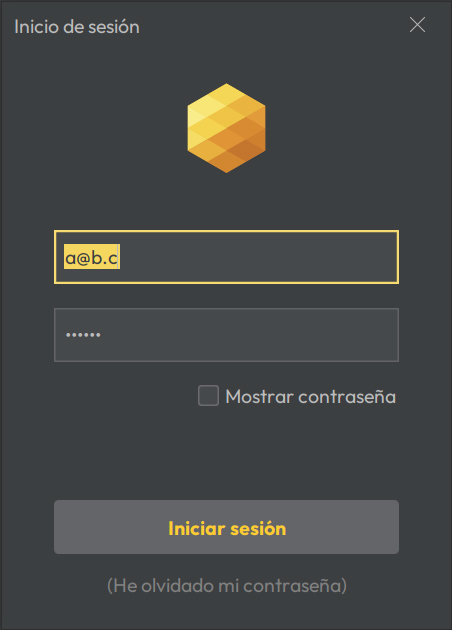
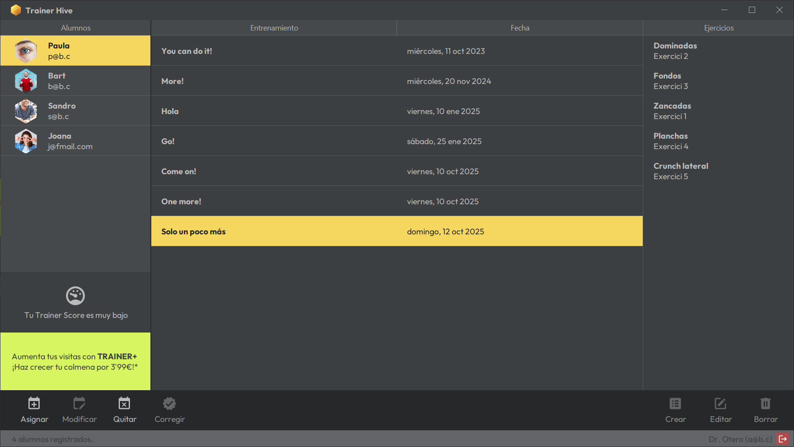
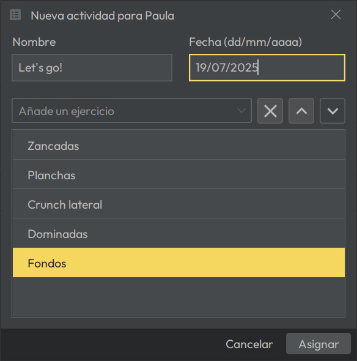

# TrainerHive

## Descripción


TrainerHive es una aplicación GUI basada en Java Swing diseñada para permitir a los instructores gestionar y revisar los entrenamientos asignados a sus usuarios. La aplicación permite que los instructores se autentifiquen, vean los usuarios que entrenan y gestionen los entrenamientos y ejercicios de manera eficiente.

---

## Capturas de Pantalla


**Ventana Principal**: La ventana inicial muestra el logo de la empresa, el enlace a la web y el icono de login.



**Diálogo de Login**: Un diálogo modal para la autenticación del instructor.



**Vista de tablas**: Ventana que muestra los alumnos registrados con el instructor y los entrenamientos asignados.



**Gestión de Entrenamientos**: Una ventana para crear, modificar y eliminar entrenamientos.

---

## Funcionalidades

### 1. **Login y Autenticación**
   - La ventana principal muestra el logo de la empresa, un enlace a la página web y un botón de login.
   - Al hacer clic en el botón de login, se abre un diálogo modal donde el instructor introduce su correo electrónico y contraseña para autenticarse.
   - Tras iniciar sesión, el instructor puede ver la lista de usuarios que está entrenando.

### 2. **Gestión de Usuarios y Entrenamientos**
   - Una vez autenticado, el instructor puede ver la lista de usuarios y sus entrenamientos asignados.
   - Al seleccionar un usuario, se muestran sus entrenamientos.
   - Al seleccionar un entrenamiento, se muestra la lista detallada de ejercicios.
   - El instructor puede crear nuevos entrenamientos o eliminarlos.

### 3. **Cerrar Sesión**
   - El instructor puede cerrar sesión desde la esquina inferior derecha de la aplicación, lo que lo llevará de vuelta a la pantalla de login.

### 4. **Menús**
   - Un menú desplegable con al menos dos opciones:
     - Cerrar la aplicación.
     - Abrir o cerrar sesión.

---

## Mejora de la Usabilidad y Rediseño

### 1. **Mejoras en la UI**
   - La interfaz de usuario ha sido diseñada para cumplir con las tendencias modernas de usabilidad como el diseño plano (flat design) y una paleta de colores atractiva.
   - Se agregaron iconos e imágenes a los componentes para mejorar la experiencia del usuario.
   - Los componentes de texto se han colocado para mejorar la legibilidad y comprensión.

### 2. **Distribución y Organización**
   - Los componentes de la UI se han reorganizado para mejorar la interacción y la organización visual.

### 3. **Manejo de Errores**
   - Se ha implementado un manejo de errores adecuado, proporcionando retroalimentación útil al usuario cuando ocurran problemas (por ejemplo, inicio de sesión fallido, datos faltantes...).

---

## Dependencias

Este proyecto requiere las siguientes dependencias:

```xml
<dependencies>
    <!-- Conexión a base de datos MS SQL Server -->
    <dependency>
        <groupId>com.microsoft.sqlserver</groupId>
        <artifactId>mssql-jdbc</artifactId>
        <version>12.8.1.jre11</version>
    </dependency>

    <!-- Librería de Bcrypt para el hash de contraseñas -->
    <dependency>
        <groupId>at.favre.lib</groupId>
        <artifactId>bcrypt</artifactId>
        <version>0.10.2</version>
    </dependency>

    <!-- Diseño plano con Flatlaf -->
    <dependency>
        <groupId>com.formdev</groupId>
        <artifactId>flatlaf</artifactId>
        <version>3.5.4</version>
    </dependency>

    <!-- Soporte para gráficos vectoriales -->
    <dependency>
        <groupId>com.kitfox.svg</groupId>
        <artifactId>svg-salamander</artifactId>
        <version>1.0</version>
    </dependency>

    <!-- Layout Absolute para componentes -->
    <dependency>
        <groupId>org.netbeans.external</groupId>
        <artifactId>AbsoluteLayout</artifactId>
        <version>RELEASE240</version>
    </dependency>

    <!-- Librería para la gestión de miniaturas de imágenes -->
    <dependency>
        <groupId>net.coobird</groupId>
        <artifactId>thumbnailator</artifactId>
        <version>0.4.20</version>
    </dependency>
</dependencies>
```

---

## Instrucciones de Configuración

1. **Clonar el repositorio**:
    
    ```bash
    git clone https://github.com/Kailuss/TrainerHive.git
    ```
    
2. **Abrir el proyecto en NetBeans**:
    
    - Importa el proyecto en NetBeans IDE.
    - Asegúrate de tener configurado Java SDK 21 en tu entorno.
3. **Ejecutar la aplicación**:
    
    - Compila y ejecuta el proyecto a través de NetBeans.

---


## Referencias

- Librería Bcrypt: [GitHub - Bcrypt](https://github.com/patrickfav/bcrypt)
- SQL Server Management Studio (para gestionar la base de datos).
- Thumbnailator: Manual de uso y guías de referencia. [Examples · coobird/thumbnailator Wiki · GitHub](https://github.com/coobird/thumbnailator/wiki/Examples)
- SalamanderSVG: Manual de usuario [http://svgsalamander.dev.java.net](http://svgsalamander.dev.java.net/)
- Para el manejo de fuentes personalizadas he recurrido a Stack Overflow.
- Para la programación de la adaptación ha pantallas HiDPI, he recurrido a ChatGPT.

---

## Problemas Conocidos y Mejoras Futuras

- **Problemas**:
    - Pequeños fallos visuales al cambiar el tamaño de la ventana.
    - Funcionalidad pendiente: Gestión de usuarios (añadir, editar, eliminar usuarios).
- **Mejoras Futuras**:
    - Implementar soporte multi-idioma.
    - Añadir la funcionalidad de búsqueda y filtrado.
